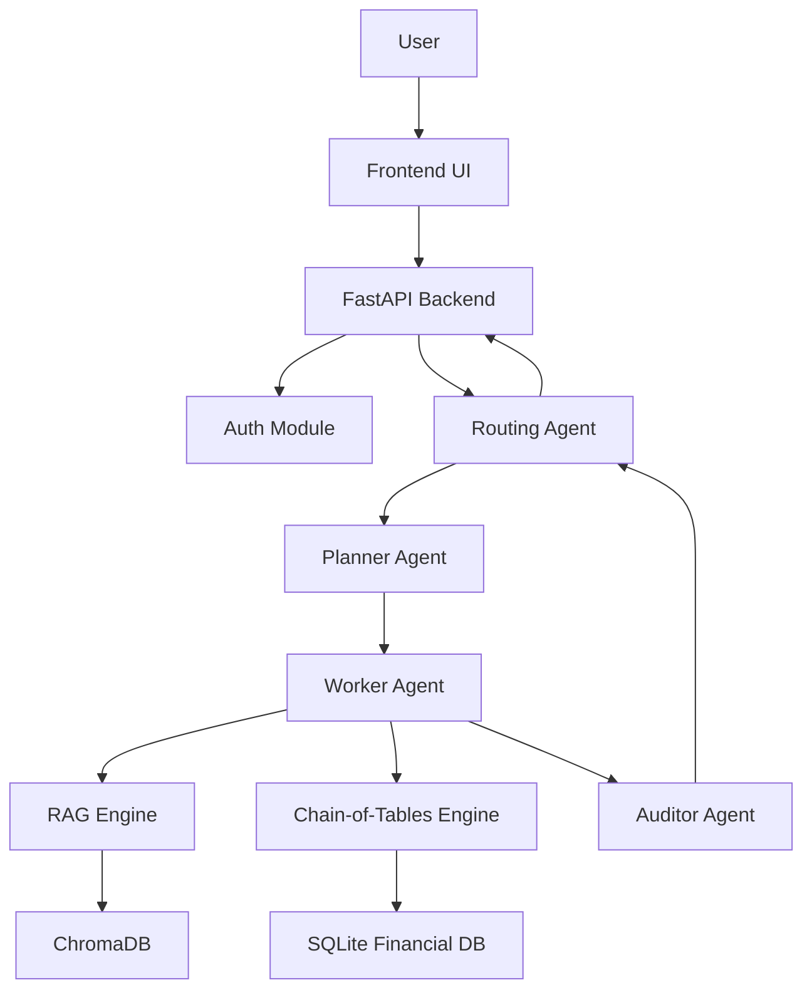
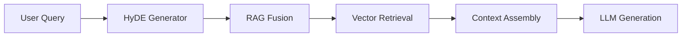

# PHASE-BY-PHASE SOFTWARE DEVELOPMENT PLAN — SMART FINANCIAL ADVISORY (SFA)

## 1. Project Overview
**Goal**: Build a secure, agentic, RAG-based financial advisory system using the RAMAS architecture (Retrieval-Augmented Multi-Agent System) with Chain-of-Tables reasoning.
**Core Technologies**: FastAPI, Python, Groq API, SQLite, ChromaDB, Jinja2, HTML/CSS/JS.
**Architecture**: Multi-Agent (Planner -> Worker -> Auditor) with RAG Fusion and Chain-of-Tables.

---

## 2. Phase-by-Phase Plan

### Phase 1: Environment Verification & Sanity Check
**Objective**: Verify the existing environment and ensure the application can start.
**Deliverables**:
- Verified `.env` configuration (Groq API Key present).
- Functional `app.py` entry point.
- Successful server startup.
**Detailed Steps**:
1.  **Environment Check**: Verify `.venv` is active and `requirements.txt` packages are installed (User confirmed).
2.  **Config Check**: Verify `.env` contains necessary keys (Groq, Secret Key).
3.  **Sanity Check**: Ensure `app.py` exists and is configured to run the FastAPI app.
**Validation**: Run `uvicorn app:app --reload` and access the health check endpoint.

### Phase 2: Database Design & Implementation
**Objective**: Set up SQLite databases for structured financial data and user management, and initialize ChromaDB.
**Deliverables**:
- `users_accounts_data.db` with schema.
- `financial_data.db` (verified connection).
- `chroma.sqlite3` (initialized).
**Detailed Steps**:
1.  **User DB Schema**: Design `users` table in `users_accounts_data.db`:
    - `id` (PK), `username`, `password_hash`, `role` (Enum: 'Admin', 'Manager'), `created_at`, `last_login`.
    - **Note**: 'Admin' adds users; 'Manager' accesses Dashboard/Chatbot.
2.  **Financial DB**: Connect to existing `financial_data.db` using SQLAlchemy/SQLite. Verify table structures.
3.  **Vector Store**: Initialize ChromaDB client pointing to `data/vector_store`.
**Files**: `api/models.py`, `backend/ingestion/sql_loader.py`.
**Validation**: Scripts to insert a dummy user and query a financial record.

### Phase 3: Authentication & Authorization System
**Objective**: Secure the application with Role-Based Access Control (RBAC).
**Deliverables**:
- Login/Logout endpoints.
- JWT token generation and validation.
- Role-based route protection.
**Detailed Steps**:
1.  **Auth Logic**: Implement `api/auth.py` using `python-jose` and `passlib`.
2.  **Endpoints**: Create `/login` (returns Token) and `/me` (returns User Profile).
3.  **Middleware**: Create `get_current_user` dependency.
4.  **RBAC**: 
    - `Admin` access: User Management endpoints.
    - `Manager` access: Dashboard, Chatbot, Traffic Light page.
5.  **Frontend Auth**: Implement login page (`login.html`) and session management.
**Files**: `api/auth.py`, `api/main.py`, `frontend/html/login.html`.
**Validation**: Test login with valid/invalid credentials; verify access control to protected routes.

### Phase 4: RAG Engine Development
**Objective**: Implement the Retrieval-Augmented Generation pipeline.
**Deliverables**:
- Text indexing and vectorization.
- RAG Fusion and HyDE implementation.
- Retrieval logic.
**Detailed Steps**:
1.  **Ingestion**: Implement `backend/ingestion/` to load text/PDF data, chunk it, and store in ChromaDB.
2.  **Retrieval**: Implement `backend/rag.py` for semantic search.
3.  **Advanced RAG**: Implement RAG Fusion (query expansion) and HyDE (Hypothetical Document Embeddings) in `backend/rag_fusion/`.
**Files**: `backend/rag.py`, `backend/rag_fusion/__init__.py`, `backend/tools/vector_tools.py`.
**Validation**: Query the system and verify relevant chunks are retrieved.

### Phase 5: Chain-of-Tables Reasoning Engine
**Objective**: Enable the system to reason over tabular financial data.
**Deliverables**:
- Chain-of-Tables logic implementation.
- SQL query generation and execution tools.
**Detailed Steps**:
1.  **Table Logic**: Implement `backend/tools/sql_tools.py` to execute safe SQL queries on `financial_data.db`.
2.  **Reasoning Chain**: Implement the "Chain-of-Tables" prompt strategy in `backend/llm.py`.
3.  **Integration**: Connect this engine to the Worker agent.
**Files**: `backend/tools/sql_tools.py`, `backend/llm.py`.
**Validation**: Ask complex numerical questions and verify correct SQL generation and answer.

### Phase 6: Multi-Agent Pipeline (RAMAS)
**Objective**: Implement the Planner-Worker-Auditor architecture with clean output generation.
**Deliverables**:
- Functional Agents: Planner, Worker, Auditor.
- Clean, user-friendly final output.
**Detailed Steps**:
1.  **Planner Agent** (`backend/agents/planner.py`): Decomposes user queries.
2.  **Worker Agent** (`backend/agents/worker.py`): Executes tasks using RAG or SQL tools.
3.  **Auditor Agent** (`backend/agents/auditor.py`): Verifies Worker outputs and **formats the final response**.
    - **Constraint**: The user must ONLY see the final, clean, verified answer. No internal monologue or raw JSON.
4.  **Orchestration**: Implement `backend/routing.py` to manage the flow.
**Files**: `backend/agents/*.py`, `backend/routing.py`.
**Validation**: Trace a query; ensure final output is clean text.

### Phase 7: Chatbot & API Integration
**Objective**: Expose the backend logic via API and connect to the frontend.
**Deliverables**:
- Chat API endpoint (`/api/chat`).
- Streaming response support (optional).
**Detailed Steps**:
1.  **API Route**: Create `POST /chat` in `api/main.py`.
2.  **Integration**: Connect the route to `backend.routing.run_pipeline`.
3.  **Formatting**: Ensure the final output is formatted as clean Markdown/Text.
**Files**: `api/main.py`.
**Validation**: Send a request via Swagger UI and receive a verified answer.

### Phase 8: Dashboard Generation (Dynamic Plotly)
**Objective**: Create the visual analytics dashboard.
**Deliverables**:
- Dashboard HTML template.
- Dynamic Plotly graph generation (side-by-side with chat).
**Detailed Steps**:
1.  **Backend Analytics**: Implement `backend/analytics/metrics.py` to fetch key financial metrics.
2.  **Plotting**: Use Plotly in Python to generate JSON graphs.
    - **Constraint**: Graph data should be returned in a format easily renderable by the frontend, potentially alongside the chat response.
3.  **Frontend**: Create `dashboard.html` and use Jinja2/JS to render the Plotly graphs.
**Files**: `backend/analytics/metrics.py`, `frontend/html/dashboard.html`.
**Validation**: Verify graphs render correctly and update based on data.

### Phase 9: Manager & Admin Panel UI
**Objective**: Build role-specific interfaces.
**Deliverables**:
- Admin Panel (User management).
- Manager Panel (Financial overview, reports).
**Detailed Steps**:
1.  **Admin UI**: `admin.html` with table of users (Add/Edit/Delete).
2.  **Manager UI**: `manager.html` with access to Chatbot and Dashboard.
3.  **Navigation**: Update `base.html` to show links based on role.
**Files**: `frontend/html/admin.html`, `frontend/html/manager.html`.
**Validation**: Log in as Admin and Manager to verify distinct views.

### Phase 10: Security, Logging & Optimization
**Objective**: Harden the system and ensure observability.
**Deliverables**:
- Audit logs.
- Secure headers.
- Performance tuning.
**Detailed Steps**:
1.  **Logging**: Implement `backend/ingestion/logger.py` to track all agent actions and queries.
2.  **Security**: Ensure SQL injection protection and XSS protection.
3.  **Optimization**: Cache frequent queries.
**Files**: `backend/ingestion/logger.py`.
**Validation**: Check logs after usage; verify security headers.

### Phase 11: Testing & Validation
**Objective**: Verify the entire system.
**Deliverables**:
- Unit tests.
- Integration tests.
- LLM Evaluation report.
**Detailed Steps**:
1.  **Unit Tests**: Test individual tools (SQL, Vector).
2.  **Integration Tests**: Test API endpoints.
3.  **LLM Eval**: Run a set of "Golden Questions" and manually grade the answers.
**Files**: `tests/`.
**Validation**: All tests pass.

### Phase 12: Packaging & Deployment
**Objective**: Prepare for delivery.
**Deliverables**:
- Final code cleanup.
- `readme.md` instructions.
**Detailed Steps**:
1.  **Cleanup**: Remove unused files.
2.  **Documentation**: Write deployment guide.
**Files**: `README.md`.

---

## 3. Timeline & Dependencies

### Gantt Chart (Text Representation)
- **Week 1**: Phase 1, 2, 3 (Verification, DB, Auth)
- **Week 2**: Phase 4, 5 (RAG, Chain-of-Tables)
- **Week 3**: Phase 6 (Agents - RAMAS)
- **Week 4**: Phase 7, 8 (Chatbot, Dashboard)
- **Week 5**: Phase 9, 10 (UI, Security)
- **Week 6**: Phase 11, 12 (Testing, Deployment)

### Module Dependency Diagram (Mermaid)

### RAG Pipeline Diagram (Mermaid)

---

## 4. Testing Framework
- **Unit Testing**: `pytest` for backend functions.
- **Integration Testing**: `TestClient` (FastAPI) for API routes.
- **LLM Evaluation**: "Golden Dataset" of 50 financial questions with known answers.
- **Security Testing**: SQL injection probes, unauthorized access attempts.

## 5. API Route Map
- `POST /api/auth/token`: Login
- `GET /api/auth/me`: Current User
- `POST /api/chat`: Send message to RAMAS
- `GET /api/dashboard/metrics`: Get dashboard data
- `GET /api/admin/users`: List users (Admin only)
- `POST /api/admin/users`: Create user (Admin only)
